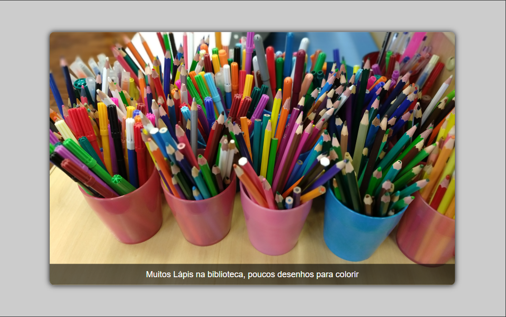

# 12-slide-fade

Situação de Atividade revisão do conteúdo estudado no primeiro semestre em HTML, CSS e introdução a JavaScript em front end.
Tendo como proposta alterar imagens do código original e realizar o acesso por JavaScript

## Layout

### Layout Desktop (1440px+)

## Tecnologias utilizadas:

* HTML
* CSS
* JavaScript

## Autor
[Edvan Alves](<https://br.linkedin.com/in/edvan-alves>)